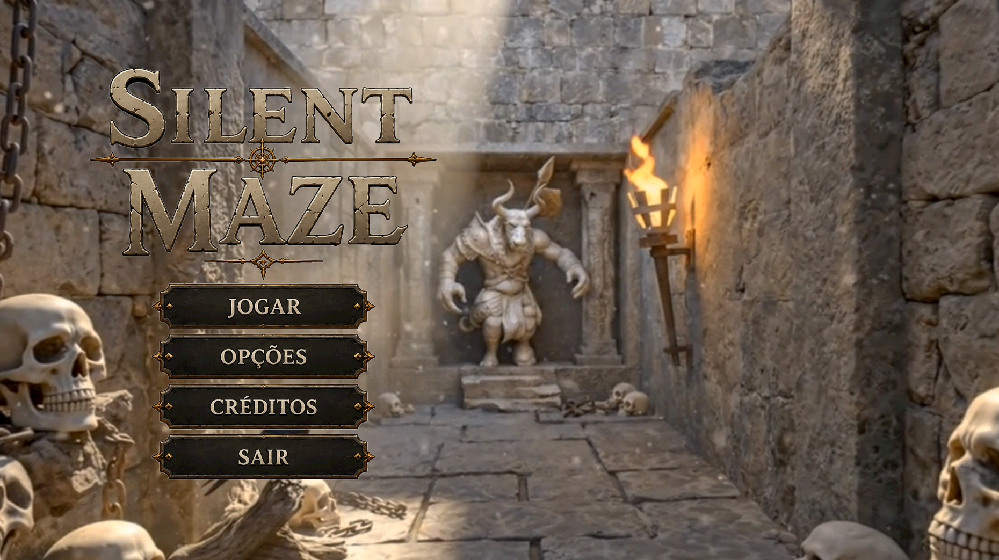

# FECAP - Fundação de Comércio Álvares Penteado

# Nome do jogo: Silent Maze

## Nome do Grupo: GJPPS

## Integrantes: <a href="https://www.linkedin.com/in/gabriel-ribeiro-alves-a5984b329/">Gabriel Ribeiro Alves</a>, <a href="https://www.linkedin.com/in/victorbarq/">Pedro Kimura</a>, <a href="https://www.linkedin.com/in/samuel-eblak-851a19367/">Samuel Eblak</a>, <a href="www.linkedin.com/in/joão-croti-4b8b573b8">João Croti</a>, <a href="https://www.linkedin.com/in/pablo-kayke-2314a5360?utm_source=share_via&utm_content=profile&utm_medium=member_ios">Pablo Kayke Fernandes Bezerra</a>.
## Professores Orientadores: <a href="https://www.linkedin.com/in/adriano-valente/">Adriano Felix Valente</a>, <a href="https://www.linkedin.com/in/dolemes/">David de Oliveira Lemes</a>, <a href="https://www.linkedin.com/in/eduardo-savino/">Eduardo Savino Gomes</a>, <a href="https://www.linkedin.com/in/luisspires/">Luis Pires</a>, <a href="https://www.linkedin.com/in/remuniz/">Renata Muniz</a>, <a href="https://www.linkedin.com/in/victorbarq/">Victor Bruno Alexander Rosetti de Quiroz</a>.

## Descrição

  Game by <a href="https://www.linkedin.com/in/gabriel-ribeiro-alves-a5984b329/">Gabriel Ribeiro Alves</a>, <a href="https://www.linkedin.com/in/victorbarq/">Pedro Kimura</a>, <a href="https://www.linkedin.com/in/samuel-eblak-851a19367/">Samuel Eblak</a>, <a href="www.linkedin.com/in/joão-croti-4b8b573b8">João Croti</a>, <a href="https://www.linkedin.com/in/pablo-kayke-2314a5360?utm_source=share_via&utm_content=profile&utm_medium=member_ios">Pablo Kayke Fernandes Bezerra</a>.

Silent Maze é um jogo de labirinto 3D em perspectiva de primeira pessoa, desenvolvido na Unity com C#, ambientado em um labirinto de inspiração mitológica grega. O jogador é lançado em um Labirinto denso de folhas e pedras, forçado a explorar com cautela, desviar de armadilhas variadas e ativar checkpoints para encontrar a saída. A atmosfera de mistério e tensão é reforçada por trilha sonora adaptativa e efeitos sonoros imersivos, tornando o labirinto em si o principal antagonista da experiência.
  
O projeto foi desenvolvido por alunos do curso de Tecnologia em Ciências da Computação da FECAP como atividade de extensão interdisciplinar, integrando conhecimentos de programação, design de jogos, ética computacional e experiência do usuário. O repositório contém o código-fonte completo em C#, o Game Design Document (GDD), assets utilizados e o build executável para Windows.
  
## 🛠 Estrutura de pastas

-Raiz 
| 
|-->documentos 
  &emsp;|-->Entrega1 
    &emsp;          |Alg_log_programacao 
    &emsp;          |Calculo1 
    &emsp;          |Eti_pensamento_computacional 
    &emsp;          |Pi_GDD 
  &emsp;|-->Entrega2 
  &emsp;          |Algoritmo_log_prog 
  &emsp;          |Calculo1 
  &emsp;          |Etica 
  &emsp;          |JogosDigitais 
  &emsp;          |Projeto_interdiciplinar 
|-->Executavel 
 &emsp;          |Build 
|-->Imagens 
  &emsp;|-->windows 
  &emsp;|-->android 
  &emsp;|-->HTML 
|-->imagens 
|-->src 
  &emsp;|-->Entrega 1 
  &emsp;|-->Entrega 2 
|readme.md 

## 🛠 Instalação

<b>Windows:</b>

Entre na pasta executável, e dentro dela contém um link do drive, lá se encontra a pasta build, baixe ela, a descompacte e execute o arquivo chamado jogo.

### Link Drive
<a href="https://drive.google.com/file/d/1tJgMmLvHKDOFK6ivBjc5r9hytL1NiPxP/view?usp=sharing">Clique aqui</a>
 
# 💻 Configuração para Desenvolvimento

## 🛠️ Ferramentas Necessárias
*   **Unity Hub**
*   **Unity Editor 6000.3.6f1**

---

## 🚀 Passos para Execução

1.  **Instale o Unity Hub**
    *   Certifique-se de estar logado na sua conta Unity.
2.  **Instale ou abra a versão Unity 6000.3.6f1**
    *   Caso não possua, baixe-a através da aba *Installs* no Unity Hub.
3.  **Abra o projeto**
    *   No Unity Hub, clique em *Add* e selecione a pasta:  
      `src/Entrega 2/`
4.  **Carregue a Cena Principal**
    *   No painel *Project*, navegue até:  
      `Assets/Scenes/Menu.unity` e dê um clique duplo para abrir.
5.  **Inicie o teste**
    *   Clique no botão **Play** (ícone de triângulo) no topo do editor para entrar no *Play Mode*.

## 📋 Licença/License
Utilize o link <a href="https://github.com/2026-1-MCC1/Projeto9">Silent Maze</a> © 2026 by <a href="https://github.com/2026-1-MCC1/Projeto9">Gabriel Ribeiro, João Croti, Pedro Kimura, Samuel Eblak e Pablo Kaique</a> is licensed under <a href="https://creativecommons.org/licenses/by/4.0/">CC BY 4.0</a>para fazer uma licença CC BY 4.0.    

## 🎓 Referências

Aqui estão as referências usadas no projeto.

1. <https://github.com/iuricode/readme-template>
2. <https://github.com/gabrieldejesus/readme-model>
3. <https://chooser-beta.creativecommons.org/>
4. <https://freesound.org/>
5. <https://www.toptal.com/developers/gitignore>
