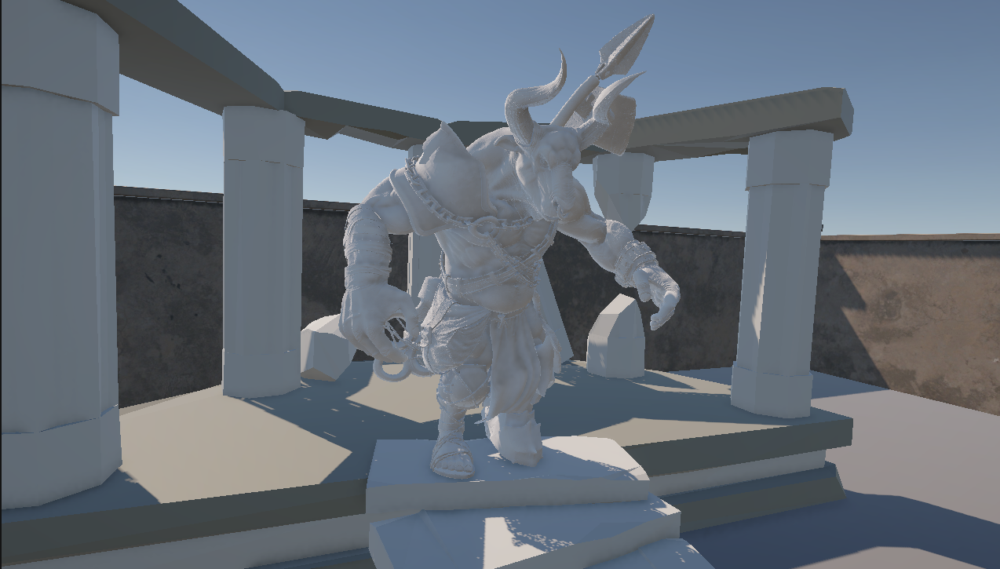

```sh
Utilize o site <https://www.toptal.com/developers/gitignore> para gerar seu arquivo gitignore e apague este campo.

Vide tutoriais do PI.
```

# FECAP - Fundação de Comércio Álvares Penteado

<p align="center">
<a href= "https://www.fecap.br/"></a>
</p>

# Nome do Projeto

## Nome do Grupo

<<<<<<< HEAD

## Integrantes: <a href="https://www.linkedin.com/in/gabriel-ribeiro-alves-a5984b329/">Gabriel Ribeiro Alves</a>, <a href="https://www.linkedin.com/in/victorbarq/">Pedro Kimura</a>, <a href="https://www.linkedin.com/in/samuel-eblak-851a19367/">Samuel Eblak</a>, <a href="www.linkedin.com/in/joão-croti-4b8b573b8">João Croti</a>, <a href="https://www.linkedin.com/in/pablo-kayke-2314a5360?utm_source=share_via&utm_content=profile&utm_medium=member_ios">Pablo Kayke Fernandes Bezerra</a>.
## Professores Orientadores: <a href="https://www.linkedin.com/in/adriano-valente/">Adriano Felix Valente</a>, <a href="https://www.linkedin.com/in/dolemes/">David de Oliveira Lemes</a>, <a href="https://www.linkedin.com/in/eduardo-savino/">Eduardo Savino Gomes</a>, <a href="https://www.linkedin.com/in/luisspires/">Luis Pires</a>, <a href="https://www.linkedin.com/in/remuniz/">Renata Muniz</a>.

## Descrição

<p align="center">

  Game by <a href="https://www.linkedin.com/in/gabriel-ribeiro-alves-a5984b329/">Gabriel Ribeiro Alves</a>, <a href="https://www.linkedin.com/in/victorbarq/">Pedro Kimura</a>, <a href="https://www.linkedin.com/in/samuel-eblak-851a19367/">Samuel Eblak</a>, <a href="www.linkedin.com/in/joão-croti-4b8b573b8">João Croti</a>, <a href="https://www.linkedin.com/in/pablo-kayke-2314a5360?utm_source=share_via&utm_content=profile&utm_medium=member_ios">Pablo Kayke Fernandes Bezerra</a>.
</p>


Silent Maze é um jogo de labirinto 3D em perspectiva de primeira pessoa, desenvolvido na Unity com C#, ambientado em um labirinto de inspiração mitológica grega. O jogador é lançado em um Labirinto denso de folhas e pedras, forçado a explorar com cautela, desviar de armadilhas variadas e ativar checkpoints para encontrar a saída. A atmosfera de mistério e tensão é reforçada por trilha sonora adaptativa e efeitos sonoros imersivos, tornando o labirinto em si o principal antagonista da experiência.
<br><br>
O projeto foi desenvolvido por alunos do curso de Tecnologia em Ciências da Computação da FECAP como atividade de extensão interdisciplinar, integrando conhecimentos de programação, design de jogos, ética computacional e experiência do usuário. O repositório contém o código-fonte completo em C#, o Game Design Document (GDD), assets utilizados e o build executável para Windows.
<br><br>
## 🛠 Estrutura de pastas

-Raiz<br>
|<br>
|-->documentos<br>
  &emsp;|-->Entrega1<br>
    &emsp;          |Alg_log_programacao<br>
    &emsp;          |Calculo1<br>
    &emsp;          |Eti_pensamento_computacional<br>
    &emsp;          |Pi_GDD<br>
  &emsp;|-->Entrega2<br>
  &emsp;          |Documentação.docx<br>
  &emsp;          |Documentação.docx<br>
  
|-->Imagens<br>
  &emsp;|-->windows<br>
  &emsp;|-->android<br>
  &emsp;|-->HTML<br>
|-->imagens<br>
|-->src<br>
  &emsp;|-->Entrega 1<br>
  &emsp;|-->Entrega 2<br>
|readme.md<br>

A pasta raiz contem dois arquivos que devem ser alterados:

<b>README.MD</b>: Arquivo que serve como guia e explicação geral sobre seu projeto. O mesmo que você está lendo agora.

Há também 4 pastas que seguem da seguinte forma:

<b>documentos</b>: Toda a documentação estará nesta pasta.

<b>executáveis</b>: Binários e executáveis do projeto devem estar nesta pasta.

<b>imagens</b>: Imagens do sistema

<b>src</b>: Pasta que contém o código fonte.

## 🛠 Instalação

<b>Android:</b>

Faça o Download do JOGO.apk no seu celular.
Execute o APK e siga as instruções de seu telefone.

```sh
Coloque código do prompt de comnando se for necessário
```

<b>Windows:</b>

Não há instalação! Apenas executável!
Encontre o JOGO.exe na pasta executáveis e execute-o como qualquer outro programa.

```sh
Coloque código do prompt de comnando se for necessário
```

<b>HTML:</b>

Não há instalação!
Encontre o index.html na pasta executáveis e execute-o como uma página WEB (através de algum browser).

## 💻 Configuração para Desenvolvimento

Descreva como instalar todas as dependências para desenvolvimento e como rodar um test-suite automatizado de algum tipo. Se necessário, faça isso para múltiplas plataformas.

Para abrir este projeto você necessita das seguintes ferramentas:

-<a href="https://godotengine.org/download">GODOT</a>

```sh
make install
npm test
Coloque código do prompt de comnando se for necessário
```

## 📋 Licença/License
Utilize o link <https://chooser-beta.creativecommons.org/> para fazer uma licença CC BY 4.0.

## 🎓 Referências

Aqui estão as referências usadas no projeto.

1. <https://github.com/iuricode/readme-template>
2. <https://github.com/gabrieldejesus/readme-model>
3. <https://chooser-beta.creativecommons.org/>
4. <https://freesound.org/>
5. <https://www.toptal.com/developers/gitignore>
6. Músicas por: <a href="https://freesound.org/people/DaveJf/sounds/616544/"> DaveJf </a> e <a href="https://freesound.org/people/DRFX/sounds/338986/"> DRFX </a> ambas com Licença CC 0.
